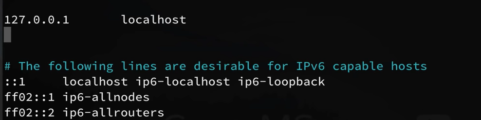

# Konfigurasi Server Linux

Akses server melalui ssh kemudian lakukan update dan upgrade.&#x20;

```
apt-get update && apt-get upgrade
```

Buat hostname baru

```
hostnamectl set-hostname user
```

Selanjutnya kita perlu menambahkan hostname yang baru ke file hosts

```
nan0 /etc/hosts
```

akan tampak tampilan seperti di bawah ini, selanjutnya tambahkan ip address dan hostname yang baru saja kita buat ke file ini.



Selanjutnya kita perlu membuat user selain root.

```
adduser mahatir
```

Selanjutnya agar user mahatir dapat menggunakan command `sudo` maka kita perlu menambahkan user tersebut ke dalam group sudo.

```
adduser mahatir sudo
```

Logout kemudian ssh kembali ke server menggunakan user baru. Pastikan posisi berada di direktori user didalam home kemudian buat direktori `.ssh`.&#x20;

```
mkdir -p ~/.ssh
```

Selanjutnya kita akan membuat ssh key di komputer agar dapat login ke server tanpa menggunakan password.

```
ssh-keygen -b 4096
```

Perintah ini akan membuat 2 file, yaitu identification file (id\_rsa) dan public key(rid\_rsa.pub). Kemudian Copy id\_rsa.pub ke authorized\_keys di server.&#x20;

```
scp /home/user/.ssh/id_rsa.pub user@IPADDREES:~/.ssh/authorized_keys
```

Selanjutnya kita perlu memberi permission kepada user

```
sudo chmod 700 ~/.ssh/
sudo chmod 600 ~/.ssh/*
```

Kita juga dapat mengatur agar server tidak dapat diakses menggunakan user root dengan mengubah beberapa pengaturan pada `sshd_config`

```
sudo nano /etc/ssh/sshd_config
```

Kemudian ubah :

1. `PermitRootLogin` menjadi `no` ,
2. `PasswordAuthentication` menjadi `no`

Setelah itu restart sshd&#x20;

```
sudo systemctl restart sshd
```

